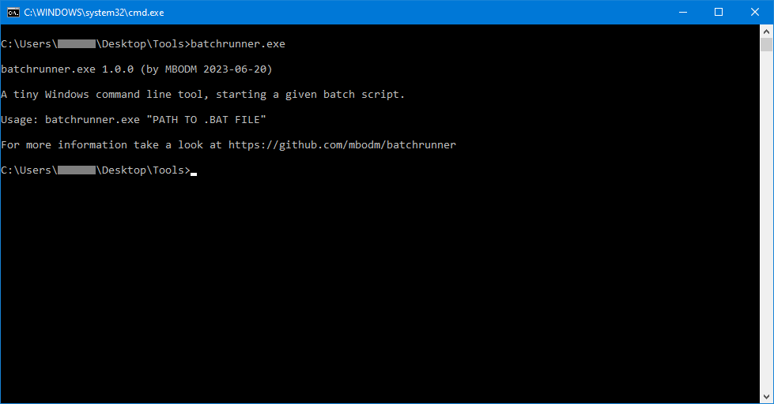

# batchrunner
A tiny tool to execute batch scripts



### What it is
- It´s a very tiny (~50 lines of code) command line executable for Windows, written in Rust.
- It´s used to run a given batch script (a `.bat` file path, given as command line argument).

### How it works
- When executed, the tool is looking for a single command line argument.
- When found, the command line argument is interpreted as file path to a batch script.
- The tool then starts the given `.bat` script file as new process.

### Why it exists
My goal was to start a batch script from the Windows 10 Taskbar. But i wasn´t able to successfully add a batch script (`.bat`), or even a link (`.lnk`) to a batch script, to the Taskbar. At least not in a way it works properly. Maybe i´m just too stupid, but all my tries had some issues. So i decided to quickly write a tiny executable, doing that job for me. Because there are no problems with _adding some executable to the Windows 10 Taskbar_, in contrast to _adding a batch script to the Windows 10 Taskbar_. And that´s the sole reason why this tool even exists. :grin:

### Requirements

- 64-bit Windows

There aren´t any other special requirements. The tool is written in Rust and the release binaries are natively compiled with `rustc` for the Windows x64 platform, assuming you are using some 64-bit Windows (and that's quite likely).

### Notes
- The tool is written in Rust
- Used Rust version is `rustc 1.69.0`
- Release binaries are compiled with `cargo build --release` on a 64-bit Windows 10 machine
- Used Windows OS version is `Windows 10 Pro 22H2 Build 19045.3086`
- The tool is developed with `VS Code 1.79.2` (with active `rust-analyzer` extension)
~~- The tool is using a `cmd.exe /c start ping.exe` approach
~~- Approach-Reason1: Issues with Rust´s `BufRead` and non-UTF8 Windows console
~~- Approach-Reason2: Need for `ctrlc` (or `windows-rs` + `SetConsoleCtrlHandler`)
~~- Approach-Reason3: Way more complexity (maintain child process, stdout, signals)
~~- And sadly i also forgot what Sean Connery teached us: "_One ping only!_"

The release binaries are compiled with following compiler options in `cargo.toml` file:
```rust
[profile.release]
opt-level = 'z'     # Optimize for size.
lto = true          # Enable Link Time Optimization.
codegen-units = 1   # Reduce number of codegen units to increase optimizations.
panic = 'abort'     # Abort on panic.
strip = true        # Strip symbols from binary.
```

#### Have fun.
